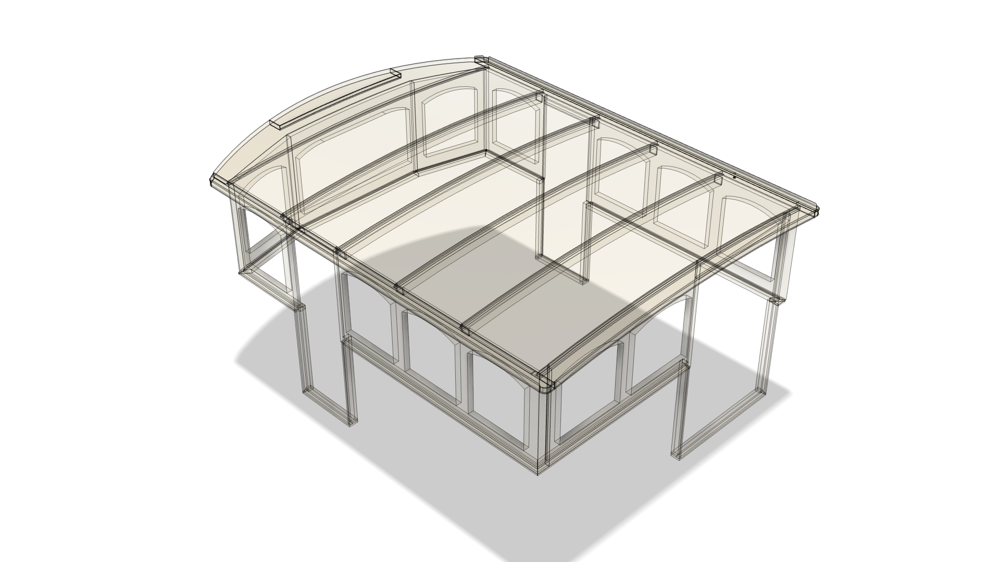

# beatrice-wheelhouse

Project to build a new half-wheelhouse for BEATRICE OF HULL.

BEATRICE's original wheelhouse is a collapsing design consisting of
removable wall panels and doors in iroko and a five-panel roof in
plywood and fibreglass.
The structure installs by hinges to an iroko plinth fixed to the
underlying steel hull.

This project proposes a design which retains the aesthetic of the
original wheelhouse and adopts its
[structural organisation](./exports/PNG/general-arrangement.png).
In particular, the proposed design uses the iroko plinth of the
original wheelhouse and supports the phased build of a replacement
wheelhouse by specifying a roof that will integrate with the
original timber structure.

The design proposal is implemented as a 3D model in
[Autodesk Fusion](https://www.autodesk.com/products/fusion-360/personal).

The
[exports](./exports/)
folder contains PNG, DWG and PDF renders of the underlying Fusion
design.

## Overview

1. Aluminium or composite, fully glazed, isolated, fixed, half-wheelhouse.
2. Two half-split doors to port and starboard side decks.
3. Twin assymmetric doors to aft deck.
4. Double/triple glazing.
5. Electrical cabling in conduits embedded in roof perimeter. 
