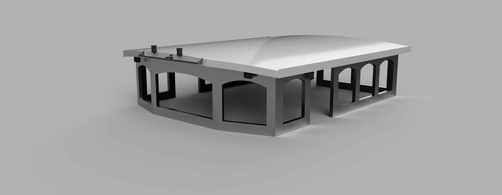

# beatrice-wheelhouse
Proposal for an aluminium half-wheelhouse wheelhouse to replace original
iroko construction.

The
[drawings](./drawings/)
folder contains the emerging 3D design maintained in
[Fusion 360 Personal](https://www.autodesk.com/products/fusion-360/personal).

The
[renders](./renders/)
folder contains some emerging images.

See [Issues](./issues) for current and emerging issues.

## Requirements

1. Aluminium, fully glazed, isolated, fixed, half-wheelhouse.
2. Two half-split doors to port and starboard side decks.
3. Twin assymmetric doors to aft deck.
4. Double/triple glazing.
5. Electrical cabling in conduits embedded in roof perimeter. 
